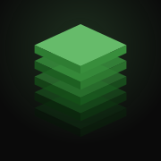

<a href="https://www.kerim0x1.com">
  
</a>

<p align="center">
  <a href="https://www.kerim0x1.com"></a>
  <a href="mailto:contact@kerim0x1.com"></a>
  <a href="https://github.com/kerim0x1/bettercode"></a>
</p>

<br>

> **ℹ️ If you know how to remove fake stars, please contact me — it's annoying.**

I take products from raw idea to shipped system and own the design, architecture and engineering in between. Full Stack Engineer, Agency Founder and Reverse Engineer.

```ts
const kerim0x1 = {
  basedIn: "Germany",
  age: 20,
  buildingSince: 11,
  shipped: "500+ projects",
  clients: ["United States", "Germany", "France", "Spain"],
  workingWith: "teams in San Francisco",
  agentsPerDay: "50+",
  building: ["BetterC0de", "FIVE STACK", "BetterVoice"],
  focus: ["full stack", "AI agents", "reverse engineering", "anti-cheat"],
  recognition: "honorable mentions from Awwwards",
};
```

## Now building

<table>
  <tr>
    <td width="50%" valign="top">
      <a href="https://betterc0de.com"></a>
      <h3><a href="https://betterc0de.com">BetterC0de</a></h3>
      <p>Every coding agent in one desktop workspace. Run Claude Code, OpenAI Codex, Cursor Agent and Grok side by side on the same repo, with a shared editor, chat, terminal and permission layer.</p>
      <p>
        <a href="https://github.com/kerim0x1/bettercode"></a>
        
        <a href="https://betterc0de.com/download"></a>
      </p>
    </td>
    <td width="50%" valign="top">
      <a href="https://github.com/kerim0x1/bettervoice"></a>
      <h3><a href="https://github.com/kerim0x1/bettervoice">BetterVoice</a></h3>
      <p>Your voice, typed anywhere. Press the hotkey, speak, press it again, and your words appear wherever your cursor is. Transcribed on your own computer or by the cloud engine you choose.</p>
      <p>
        <a href="https://github.com/kerim0x1/bettervoice/releases/latest"></a>
        
        
      </p>
    </td>
  </tr>
  <tr>
    <td colspan="2" valign="top">
      <a href="https://www.fivestacks.dev"></a>
      <h3><a href="https://www.fivestacks.dev">FIVE STACK</a></h3>
      <p>Scripts and AI tools for FiveM, RedM and Roblox. Ready-made server scripts for ESX, QBCore and Qbox that sit at 0.00 ms idle, plus AI tools that write the code: 40+ models working from 600K+ indexed scripts, a live preview and 400+ free developer tools.</p>
      <p>
        <a href="https://www.fivestacks.dev"></a>
        
        
        
      </p>
    </td>
  </tr>
</table>

## Selected work

| Project | What it is |
| :-- | :-- |
| **[Framecoded](https://github.com/kerim0x1/framecoded)**<br><sub>Open source</sub> | Export Framer websites into clean, modular Next.js, TanStack Start and Astro projects. |
| **DonutSMP Detection**<br><sub>External research</sub> | Tracked **1,110+** suspected cheater accounts in twelve days without server access. |
| **Anti Cheat Detection**<br><sub>Security research</sub> | Fingerprint based detection for Meteor, Wurst, LiquidBounce, OpSec and ExploitPreventer. |
| **CFX Security Audit**<br><sub>Code review</sub> | Audit of citizenfx/fivem: 14 findings covering memory safety, buffer handling, and network protocol parsing. |

## What I do

| Area | Focus |
| :-- | :-- |
| **AI Agent Engineering** | Support agents, custom lead agents and durable [Eve](https://eve.dev) agents on the [AI SDK](https://ai-sdk.dev). Tools, memory and outcomes live in PostgreSQL, so the system learns from that database automatically. |
| **Full Stack Engineering** | Full product delivery across frontend, backend, architecture, infrastructure and deployment. |
| **Agency Founder** | Product, design and engineering delivery for companies and teams across four countries. |
| **Interface Engineering** | Interface design in Figma and Framer, backed by robust frontend systems. |
| **FiveM Security** | Reverse engineering FiveM resources, exploit surfaces, fingerprint detection and defensive security systems. |
| **Minecraft Engineering** | Java mods, server systems, server-side anti-cheats and fingerprint-based detection. |

## Stack

<a href="https://www.kerim0x1.com">
  
</a>

<sub>Plus TanStack, Framer, C#, Kotlin, Swift, AI SDK, Eve, AI Gateway, Claude and Codex.</sub>

<br>

<p align="center">
  <sub>Open for new projects · <a href="https://www.kerim0x1.com">kerim0x1.com</a> · <a href="mailto:contact@kerim0x1.com">contact@kerim0x1.com</a></sub>
</p>
